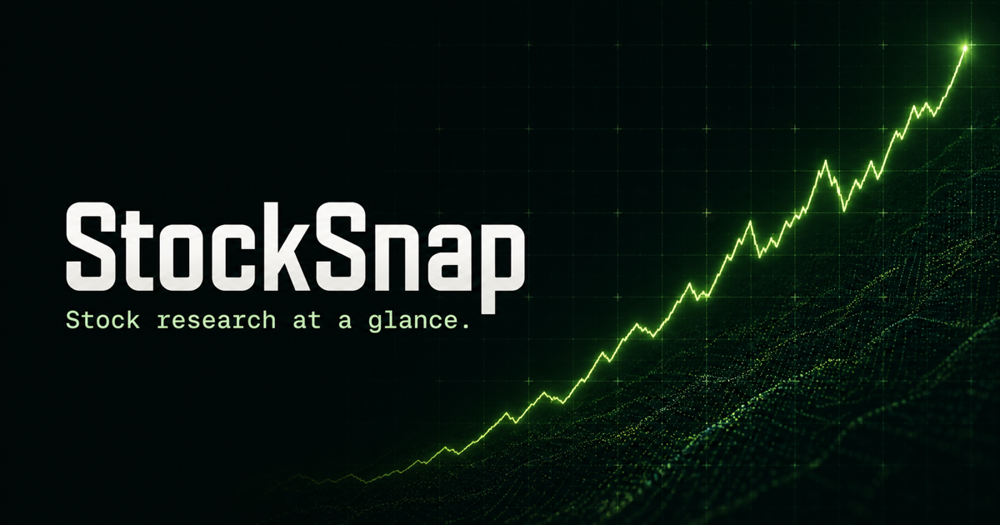

# StockSnap

StockSnap is a stock-research web app that combines price performance, company comparisons, a device-local watchlist, and normalized SEC fundamentals in one focused dashboard.



## Why this project stands out

Stock apps often depend on one opaque data feed. StockSnap separates the pipeline into two traceable layers: daily market data from Alpha Vantage and reported business fundamentals from SEC EDGAR. It also handles provider limits, caching, missing financial concepts, point-in-time filtering, and a clearly labeled no-key demo mode.

## Important features

- Search the SEC directory instead of relying on a small hardcoded ticker list
- Explore interactive 1-month, 3-month, and 1-year price performance
- Compare two stocks on a normalized-return chart
- Save a private watchlist in the browser without creating an account
- Review market cap, P/E, EPS, beta, volume, and 52-week range
- Connect price movement to five years of revenue, net income, and cash flow
- Query point-in-time SEC fundamentals through the Python API
- Fall back gracefully when an upstream market provider is unavailable

## Architecture

```text
Alpha Vantage ─────┐
                   ├── FastAPI data service ── normalized stock snapshot
SEC EDGAR ─────────┤             │
                   │             ▼
FRED ──────────────┘      React / vinext UI
                                │
                                └── local browser watchlist
```

The Python FastAPI service is the portfolio backend. Equivalent read-only edge routes are included so the hosted frontend can run independently and show a transparent demo dataset when no market-data key is configured.

## Stack

- Python 3.12, FastAPI, HTTPX, pytest
- TypeScript, React 19, vinext
- HTML Canvas charting with no chart-library dependency
- SEC EDGAR Company Facts and ticker-directory APIs
- Alpha Vantage daily market data
- Federal Reserve Economic Data (FRED)
- Docker, Docker Compose, and GitHub Actions

## Run locally

### Docker

Copy the environment template and add your credentials:

```bash
cp .env.example .env
docker compose up --build
```

Open `http://localhost:3000`. FastAPI documentation is available at `http://localhost:8000/docs`.

### Without Docker

Backend:

```bash
python -m venv .venv
source .venv/bin/activate
pip install -r requirements-dev.txt
uvicorn backend.app.main:app --reload
```

Frontend, in another terminal:

```bash
npm install
NEXT_PUBLIC_API_BASE_URL=http://localhost:8000 npm run dev
```

If `NEXT_PUBLIC_API_BASE_URL` is omitted, the frontend uses its built-in edge API and demo market snapshot.

## Environment variables

| Variable | Required | Purpose |
| --- | --- | --- |
| `SEC_USER_AGENT` | Yes for production | Identifies your SEC API client with a name and email |
| `ALPHA_VANTAGE_API_KEY` | For live prices | Enables daily price history and market statistics |
| `ALLOWED_ORIGINS` | Backend deployments | Comma-separated frontend origins allowed by CORS |
| `NEXT_PUBLIC_API_BASE_URL` | Optional | Points the frontend at the Python API |

Alpha Vantage’s free plan is rate-limited. StockSnap caches successful upstream responses for six hours to use that allowance responsibly.

## API

```http
GET /api/health
GET /api/companies
GET /api/search?q=apple
GET /api/stock?ticker=AAPL
GET /api/company?ticker=AAPL
GET /api/company?ticker=AAPL&as_of=2024-06-30
GET /api/macro
```

The `as_of` parameter excludes SEC facts published after the selected date. This prevents historical analysis from accidentally seeing future information.

## Verification

```bash
pytest
npm test
npm run lint
```

GitHub Actions runs the Python and frontend suites on every push and pull request.

## Deployment

Both services are containerized. Deploy the root `Dockerfile` for the API and `Dockerfile.web` for the frontend, or deploy the frontend independently with its built-in routes.

For live prices, add `ALPHA_VANTAGE_API_KEY` to the API or frontend hosting environment. Never expose the key through a `NEXT_PUBLIC_` variable.

## Data policy

StockSnap uses public SEC and Federal Reserve data. Live market data is requested through the documented Alpha Vantage API. The bundled market snapshot is explicitly marked as demonstration data and should not be treated as current pricing.

This project is educational and does not provide investment advice.

## License

[MIT](LICENSE)
