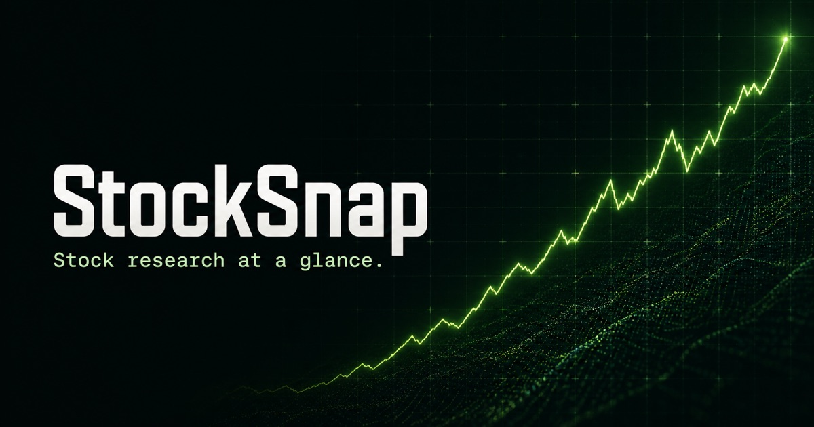

# StockSnap

StockSnap is a stock-research web app that combines price performance, company comparisons, a device-local watchlist, and normalized SEC fundamentals in one focused dashboard.

[View the live StockSnap app](https://stocksnap-phi.vercel.app)

[](https://vercel.com/new/clone?repository-url=https%3A%2F%2Fgithub.com%2Fak-sh1%2FStockSnap)



## Why this project stands out

Stock apps often depend on one opaque data feed. StockSnap separates the pipeline into two traceable layers: daily market data from Twelve Data (with Alpha Vantage fallback) and reported business fundamentals from SEC EDGAR. It also handles provider failover, caching, missing financial concepts, point-in-time filtering, and a clearly labeled no-key demo mode.

## Important features

- Search the SEC directory instead of relying on a small hardcoded ticker list
- Explore interactive 1-month, 3-month, and 1-year price performance
- Compare two stocks on a normalized-return chart
- Save a private watchlist in the browser without creating an account
- Review market cap, P/E, EPS, beta, volume, and 52-week range
- Connect price movement to five years of revenue, net income, and cash flow
- Query point-in-time SEC fundamentals through the Python API
- Fall back gracefully when an upstream market provider is unavailable

## Architecture

```text
Twelve Data ───────┐
Alpha Vantage ─────┤
SEC EDGAR ─────────┼── Next.js API routes ── StockSnap dashboard
FRED ──────────────┘            │                        │
                                │                        └── local browser watchlist
                                └── optional FastAPI service when using Docker
```

The public Vercel deployment uses the built-in Next.js API routes, so the website is one deployable application. The Python FastAPI service remains as a portfolio-quality data-pipeline implementation and is used by the Docker Compose setup. Both paths show a transparent demo dataset when no market-data key is configured.

## Stack

- Python 3.12, FastAPI, HTTPX, pytest
- TypeScript, React 19, Next.js 16
- HTML Canvas charting with no chart-library dependency
- SEC EDGAR Company Facts and ticker-directory APIs
- Twelve Data daily market data with Alpha Vantage fallback
- Federal Reserve Economic Data (FRED)
- Docker, Docker Compose, and GitHub Actions

## Run locally

### Docker

Copy the environment template and add your credentials:

```bash
cp .env.example .env
docker compose up --build
```

Open `http://localhost:3000`. FastAPI documentation is available at `http://localhost:8000/docs`.

### Without Docker

Backend:

```bash
python -m venv .venv
source .venv/bin/activate
pip install -r requirements-dev.txt
uvicorn backend.app.main:app --reload
```

Frontend, in another terminal:

```bash
npm install
NEXT_PUBLIC_API_BASE_URL=http://localhost:8000 npm run dev
```

If `NEXT_PUBLIC_API_BASE_URL` is omitted, the frontend uses its built-in Next.js API and demo market snapshot.

## Environment variables

| Variable | Required | Purpose |
| --- | --- | --- |
| `SEC_USER_AGENT` | Yes for production | Identifies your SEC API client with a name and email |
| `TWELVE_DATA_API_KEY` | Preferred for prices | Enables one-year daily price history for broad US-stock coverage |
| `ALPHA_VANTAGE_API_KEY` | Optional fallback | Enables daily prices and additional market statistics |
| `ALLOWED_ORIGINS` | Backend deployments | Comma-separated frontend origins allowed by CORS |
| `NEXT_PUBLIC_API_BASE_URL` | Optional | Points the frontend at the Python API |

StockSnap requests Twelve Data first because one call supplies the price, chart history, volume, and 52-week range. It falls back to Alpha Vantage when that provider is configured. Successful responses are cached for six hours to use provider allowances responsibly.

## API

```http
GET /api/health
GET /api/companies
GET /api/search?q=apple
GET /api/stock?ticker=AAPL
GET /api/company?ticker=AAPL
GET /api/company?ticker=AAPL&as_of=2024-06-30
GET /api/macro
```

The `as_of` parameter excludes SEC facts published after the selected date. This prevents historical analysis from accidentally seeing future information.

## Verification

```bash
pytest
npm test
npm run lint
```

GitHub Actions runs the Python and frontend suites on every push and pull request.

## Deployment

### Vercel (recommended)

Import this GitHub repository into Vercel or use the **Deploy with Vercel** button above. Vercel detects Next.js, builds the app, and deploys the frontend together with its built-in API routes. Connect the repository once and every push to `main` can produce a new production deployment; pull requests receive preview deployments.

For broad price coverage, add `TWELVE_DATA_API_KEY` as a Vercel environment variable for Production and Preview. You can also add `ALPHA_VANTAGE_API_KEY` as a fallback. Never expose either key through a `NEXT_PUBLIC_` variable. The app works without them using clearly labeled demonstration market data.

### Docker (optional)

Docker is not required for the Vercel deployment. It is included for running the full two-service stack anywhere containers are supported:

- `Dockerfile` packages the Python FastAPI data service.
- `Dockerfile.web` packages the production Next.js server.
- `compose.yaml` builds both images, connects the frontend to the API, and exposes ports `3000` and `8000`.

Docker keeps the operating system, language runtimes, and dependencies consistent across laptops, CI, and container hosts. That prevents “works on my machine” setup differences and makes the full stack start with one command.

## Data policy

StockSnap uses public SEC and Federal Reserve data. Market prices are requested through documented Twelve Data and Alpha Vantage APIs. The bundled market snapshot is explicitly marked as demonstration data and should not be treated as current pricing. Before displaying provider data publicly, use a plan whose license covers your intended display or distribution.

This project is educational and does not provide investment advice.

## License

[MIT](LICENSE)
